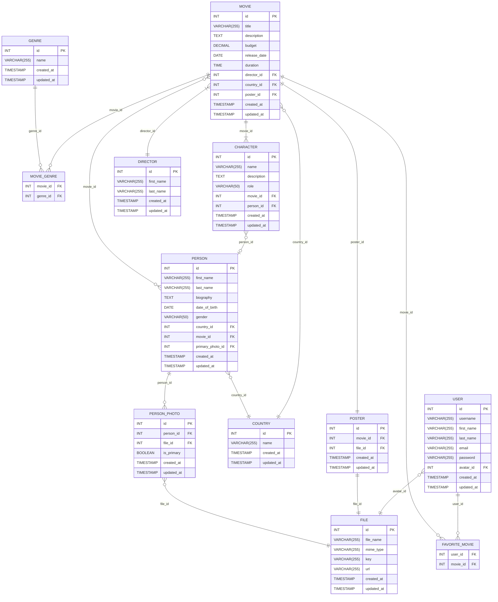

```mermaid
    erDiagram
        USER {
            INT id PK
            VARCHAR(255) username
            VARCHAR(255) first_name
            VARCHAR(255) last_name
            VARCHAR(255) email
            VARCHAR(255) password
            INT avatar_id FK
            TIMESTAMP created_at
            TIMESTAMP updated_at
        }

        FILE {
            INT id PK
            VARCHAR(255) file_name
            VARCHAR(255) mime_type
            VARCHAR(255) key
            VARCHAR(255) url
            TIMESTAMP created_at
            TIMESTAMP updated_at
        }

        MOVIE {
            INT id PK
            VARCHAR(255) title
            TEXT description
            DECIMAL budget
            DATE release_date
            TIME duration
            INT director_id FK
            INT country_id FK
            INT poster_id FK
            TIMESTAMP created_at
            TIMESTAMP updated_at
        }

        GENRE {
            INT id PK
            VARCHAR(255) name
            TIMESTAMP created_at
            TIMESTAMP updated_at
        }

        MOVIE_GENRE {
            INT movie_id FK
            INT genre_id FK
        }

        CHARACTER {
            INT id PK
            VARCHAR(255) name
            TEXT description
            VARCHAR(50) role
            INT movie_id FK
            INT person_id FK
            TIMESTAMP created_at
            TIMESTAMP updated_at
        }

        PERSON {
            INT id PK
            VARCHAR(255) first_name
            VARCHAR(255) last_name
            TEXT biography
            DATE date_of_birth
            VARCHAR(50) gender
            INT country_id FK
            INT movie_id FK
            INT primary_photo_id FK
            TIMESTAMP created_at
            TIMESTAMP updated_at
        }

        FAVORITE_MOVIE {
            INT user_id FK
            INT movie_id FK
        }

        COUNTRY {
            INT id PK
            VARCHAR(255) name
            TIMESTAMP created_at
            TIMESTAMP updated_at
        }

        POSTER {
            INT id PK
            INT movie_id FK
            INT file_id FK
            TIMESTAMP created_at
            TIMESTAMP updated_at
        }

        DIRECTOR {
            INT id PK
            VARCHAR(255) first_name
            VARCHAR(255) last_name
            TIMESTAMP created_at
            TIMESTAMP updated_at
        }

        PERSON_PHOTO {
            INT id PK
            INT person_id FK
            INT file_id FK
            BOOLEAN is_primary
            TIMESTAMP created_at
            TIMESTAMP updated_at
        }

        USER }o--|| FILE: "avatar_id"
        MOVIE }|--|| DIRECTOR: "director_id"
        MOVIE }o--|| COUNTRY: "country_id"
        MOVIE ||--|| POSTER: "poster_id"
        MOVIE ||--o{ MOVIE_GENRE: "movie_id"
        GENRE ||--o{ MOVIE_GENRE: "genre_id"
        MOVIE ||--|{ CHARACTER: "movie_id"
        POSTER ||--|| FILE: "file_id"
        CHARACTER }o--o| PERSON: "person_id"
        PERSON }o--o{ MOVIE: "movie_id"
        PERSON }o--|| COUNTRY: "country_id"
        PERSON ||--o{ PERSON_PHOTO: "person_id"
        PERSON_PHOTO }o--|| FILE : "file_id"
        USER ||--o{ FAVORITE_MOVIE: "user_id"
        MOVIE ||--o{ FAVORITE_MOVIE: "movie_id"
```
